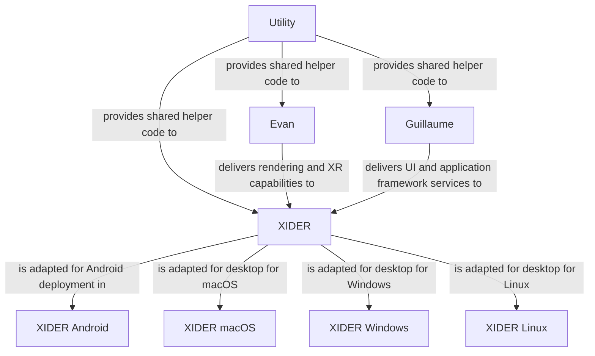

# Project architecture

This document outlines the technical architecture of the XIDER project, detailing its structure, components, and design principles to ensure reliability and maintainability.

## Architecture Overview

The project contain several repositories, each serving a specific purpose within the overall architecture:

- utility: A collection of helper functions and utilities used across different modules of the project.
- evan: The core graphical API based on Vulkan, GLFW, and OpenXR, providing cross-platform support for XR applications.
- guillaume: The UI library designed for XR and desktop software, facilitating the creation of user interfaces.
- xider: The main Integrated Development Environment (IDE) for XR application development, integrating the functionalities of the other repositories.
- xider-android: The Android-specific implementation of the XIDER IDE, enabling deployment on Android devices.
- xider-macos: The macOS-specific implementation of the XIDER IDE, enabling deployment on macOS devices.
- xider-windows: The Windows-specific implementation of the XIDER IDE, enabling deployment on Windows devices.
- xider-linux: The Linux-specific implementation of the XIDER IDE, enabling deployment on Linux devices.

## Design Principles

The architecture is designed with the following principles in mind:

- Modularity: Each repository is designed to function independently, allowing for easier maintenance and updates.
- Scalability: The architecture supports the addition of new features and components without significant restructuring.
- Cross-Platform Compatibility: The use of Vulkan, GLFW, and OpenXR ensures that applications can run on multiple platforms seamlessly.
- Community Engagement: The architecture is open to contributions from the community, encouraging collaboration and innovation.

## Documentation Structure

Each repository has dedicated documentation to provide detailed information about its design, implementation, and usage. We use GitHub Wikis to host the documentation for easy access and collaboration.

- [utility Wiki](https://github.com/etib-corp/utility/wiki)
- [evan Wiki](https://github.com/etib-corp/evan/wiki)
- [guillaume Wiki](https://github.com/etib-corp/guillaume/wiki)
- [xider Wiki](https://github.com/etib-corp/xider/wiki)

## Build and Deployment

The build process for each repository is documented within its respective Wiki. Instructions for setting up the development environment, building the code, and deploying applications are provided to facilitate ease of use.

We use [CMake](https://cmake.org/) as the primary build system, ensuring consistent builds across different platforms.

We use [GitHub Actions](https://github.com/features/actions) for continuous integration and deployment, automating the build and testing processes to maintain code quality.

We use [GitHub Pages](https://pages.github.com/) to host the api documentation for easy access by developers and users.

## Testing and Quality Assurance

To ensure the reliability of the architecture, we have implemented comprehensive testing strategies, including unit tests. Each repository contains its own set of tests to validate functionality and performance.

We use [Google Test](https://github.com/google/googletest) as the testing framework for writing and running unit tests across all repositories.
